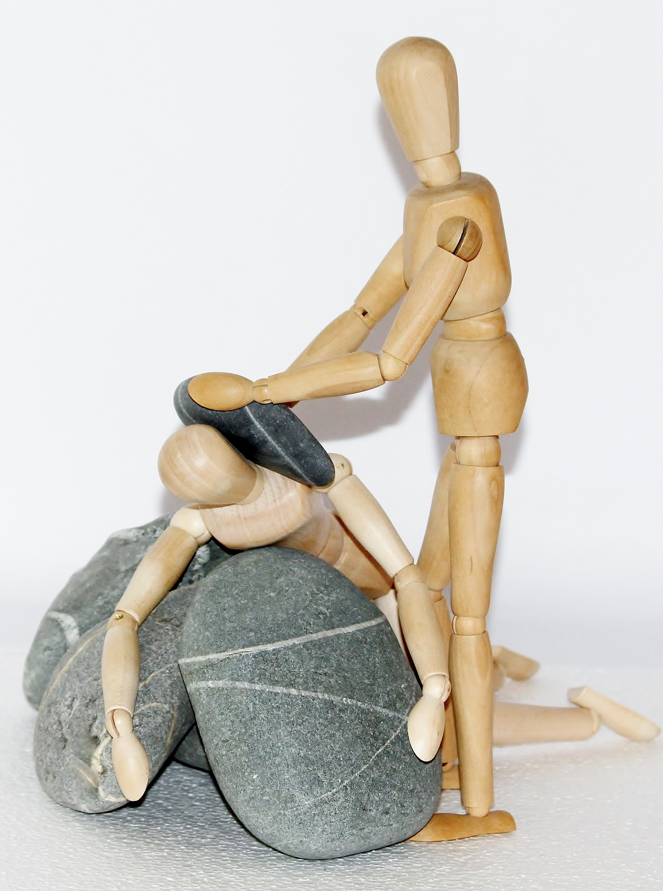

¿No se han puesto a pensar que a veces elegir a un amigo es igual o más complicado que elegir una pareja?

Seré sincera con ustedes, conseguir amistades para mi no ha sido nada fácil, supongo que debe ser algo que se aprende desde niño y no lo aprendí muy bien. 

Se supone que en esta etapa de la vida ya tengas claro qué tipo de personas quieres en tu vida, parejas, amigos, compañeros de trabajo, etc, etc porque lo fuiste perfeccionando desde los inicios de tu vida, en el colegio y en algunos casos en la universidad. 

Yo les confieso que a mis 31 años todavía no lo tengo muy claro, ¿que se supone que se busque en una amistad? ¿De que personas te tienes que alejar y con quien quedarte?

Pasamos gran parte de nuestras vidas “quemando” el tiempo con personas que no nos hacen bien o persona que simplemente nos caen muy mal pero seguimos siendo sus “amigos” ¿Por que? 

Algunos expertos hablan de ese miedo a “quedarnos solos”, puede ser, pero ¿por qué lo hacemos? ¿No hay un dicho que dice “mejor solo que mal acompañado”? 

Si nos ponemos a pensar un poco más en el tema, se vuelve incluso más complejo, ¿qué pasa si nadie nos cae bien y nunca hacemos amigos?¿ y si el problema somos nosotros que no sabemos hacer amigos? o ¿tenemos poca tolerancia?. Es una línea muy delgada, ese dilema en el que tenemos que respetar y tolerar a los seres humanos como son y en esa otra parte que dice que no deberíamos estar con personas que no nos aportan en nuestra vida.

A veces vivo con un poco de temor (quién no), ¿qué pasa si consigo de esas personas que aportan a mi vida y ellas consideran que yo no? ¿que si no soy suficiente para ellas y ellas para mi sí? ¿Estoy destinada a estar con personas que no me aportan?

Y ¿qué es “aportar”? ¿Que son esas cosas que tiene que tener una persona para llenar tu vida? sinceramente no lo tengo nada claro, no se cuales son esas cosas que me aportan a mi, pero la magia de la vida es irlas descubriendo cada día.

El minimalismo por su lado plantea una filosofía en la que deberíamos quedarnos sólo con aquellas cosas que realmente nos hagan felices, esas pocas cosas que nos llenan, incluyendo las personas que nos rodean, nuestras amistades. Pero cuando empiezas a aplicarlo se vuelve realmente aterrador,  descubrir que cada amistad que tienes a tu lado no te hace feliz y poco a poco te empiezas a alejar de ellas.

También dicen que una vez que alejas todos esos compromisos sociales a los que no quieres ir empiezas a tener tiempo para hacer las cosas que realmente te gusta, ir a la clase de baile que siempre quisiste, o a la de canto o actuación o la que sea que les guste. Con esto conoces personas diferentes, personas más compatibles, porque al final la vida es un ensayo y error, ir creciendo, ir conociendo personas diferentes, y todas te dejaran algo con algunas creceras por más tiempo, y otras se irán, a algunas serás tú quien marque sus vidas (esperemos que para bien) y si tienes buena suerte o buen ojo, algunas muy pocas se quedarán para siempre, serán tu apoyo tus verdaderos amigos.

 Bueno eso creo, capaz puede ser algo fantasioso pero eso espero de una amistad, apoyo cuando lo necesitas, sentir que creces cuando hablas con esa persona y el(la) crece y no solo de temas profesionales hablo, sino del espíritu, tu alma, tu alegría, al final elegir a un amigx no es tan diferente a conseguir tu o tus medias naranjas. 

Dicen por ahí “el que vive con miedo a estar solo, muere mal acompañado” salgamos a la calle busquemos una buena compañía, no nos conformemos con ese amigo que no toleramos sólo para no estar sólos, capaz, solo quizás, así creceremos un poquito más y cuando lo consigan quieranlo, tolerenlo y entiendanlo.

Y ustedes, ¿ya consiguieron sus medias naranjas?

Comentanos más abajo (recarguen la pagina si no salen los comentarios de facebook)
