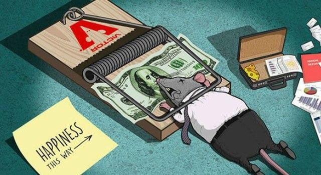

¿Alguna vez has sentido que no encajas en el sistema? ¿Que por más que lo intentes todos los días, pareciera que no eres parte de este planeta? como si fueran la oveja negra, la fruta podrida o una manzana en un árbol de olivo. 

¿Alguna vez has sentido que nadie te entiende, que la gente te subestima? ¿Has sentido esa sensación de que el mundo pareciera moverse en una dirección y tú vas caminando en contrario, como en contra flujo? 

Si has sentido eso, sin duda eres uno de los míos. Es bueno que sepas que no estas tan solo, también me he sentido así millones de veces, capaz no vamos al mismo sentido pero sin duda ambos sentimos que vamos en sentido opuesto al resto. 

No se si tiene que ver con la dislexia, no se si tu tambien tengas una de esas condiciones extrañas que te hacen ver el mundo diferente pero se que no es fácil vivir así y peor aún tratar de encajar, calzar, acoplarse, como quieran decirle, en el sistema. 

Desde que somos pequeños nos entrenan para encajar en este rompecabezas que se llama sistema, manejado por unos cuantos idiotas que se creen más inteligentes que el resto, con un montón de borregos que aspiran a ser tan idiotas como ellos. 
Y digo que nos “entrenan” porque llamarle “educación” a nuestro sistema sería una total degeneración de la palabra, porque vivimos en un sistema que nos entrenan como los perros de pavlov, como uno más de la manada.

Así cuando seamos adultos podamos tener un trabajo estable, con un sueldo mediocre, tolerando razonamientos absurdos, liderado por personas mucho más absurdas. Todo para conseguir un dinero que tendremos que gastar en enriquecer a las mismas instituciones que nos lo pagaron, un ciclo en el que sólo ellos ganan. 

Pero nos entrenaron para eso, para vivir así y llamarle a esa aberración éxito.

Vivo en un sistema en el que vale más la nota que saques en un examen de 2 horas que lo que hay en tu cerebro, y digo vivo porque pareciera que el resto esta bien con eso.

Un sistema que le parece bien aplastar a las minorías y aquí estamos, unos pocos que ven el mundo diferente tratando de luchar con él todos los días, tratando de “subirse al tren” de “dejarnos llevar por la corriente” tratando de entender todos los días la lógica de este sistema absurdo pero con el que todos parecen estar contentos.

Todos parece que encontraron su lugar, parece que encajaron en el puzzle, o que encontraron su posición en la carrera de las ratas, mientras unos pocos seguimos tratando de entender la lógica. 

Vivimos en un sistema en el que el promedio de vida es 68 años, de los cuales unos cuantos minutos suelen determinar nuestro destino. 

Una hora de una entrevista de trabajo determina tu capacidad para un cargo en que probablemente estés mucho más capacitado que los que te entrevistan. Pero y si te va mal, ¿y si hoy no era uno de esos buenos días? ¿Qué tal si tu ropa no les gusto? ¿O el color de tu cabello? ¿O quizás tenías muchos tatuajes? En ese caso valdría muy poco lo que está en tu cerebro, y solo unos minutos bastaron para determinar si estabas capacitado para el cargo o no

Quizás dos horas de tu vida determinaron si eras lo suficientemente inteligente para entrar en una universidad y convertirte en un profesional que aporte a “su nación” 

¿Dicen que la primera impresión es lo que cuenta no? Esos 5 minutos que determinan la percepción que tendrán las personas de ti por el resto de su vida. 

Por supuesto, si sabes que ellos no tienen la impresión de ti que tu sabes que eres entonces tendrás que poner un esfuerzo muy grande por hacerles cambiar de opinión, esforzarte por cambiar la opinión de alguien que posiblemente no vale la pena pero así es el sistema. Es importante cómo te ve el sistema, de eso depende tu carrera de “éxito”.

Si lo analizas de afuera no pareciera tan dificil encajar, solo tienes que decir lo que ellos quieren escuchar, vertirte como ellos quieren que te vistas, y lucir como ellos quieren que luzcan, parece tan simple, tan tonto, ¿pero que hay de lo que eres tu?

Por qué tenemos que cambiar lo que somos, lo que queremos ser, lo que nos hace felices, para encajar en un sistema de mierda que no te da nada a cambio. 

Disculpen, corrijo,  si te da mucho a cambio, te da una cantidad de deudas que adquiriste en cosas que ellos mismos te hicieron creer que necesitabas, te dan la ansiedad que no te permite dormir por la noches ni te permite pensar con claridad. Todo para al día siguiente escuchar un par de cretinos juzgaste porque creen saber quien eres, porque creen que saben lo que sientes, cómo vives y que necesitas.

Un par de cretinos que el sistema se los comió y ni siquiera lo han notado. Aquellos monigotes que están empeñados en que tú sigas su mismo camino porque “así es la vida”.

Y ¿qué pasa si intentas salir del sistema?, si intentas vivir a tu manera, fuera de él. Pues te come más rápido, te destruye más rápido, se consume tu moral y tu autoestima, se encarga de recordarte cada minuto de tu vida que no estás dentro de él y que eso no está bien. 

¿Alguna vez se han preguntado por qué el estado promueve el empleo? ¿Porque te dan bonos por empezar a trabajar de nuevo? 

Me parece tan irónico escuchar en las noticias cuando dicen con alegría que la tasa de empleo ha aumentado un 2%, como si fuera algo bueno. ¿Quién dijo que era bueno trabajar en este sistema del asco?.

Claro, pero como buenos conocedores del sistema sabemos que la tasa de empleo determina en gran medida la estabilidad económica de un país, nos ayuda a tener tener un lindo y hermoso número en el PIB. Un PIB que en su mayoría solo sirve para pagar más cuando está mal, pero nunca menos cuando está bien, porque las cosas nunca bajan de precio solo suben y suben para enriquecer a los mismos de siempre. 

Enriquecer a esos mismos que sí encontraron la clave del éxito, esos que sí supieron explotar a unos cuantos millones de borregos para aumentar fortunas que no podrán gastarse en vida, ellos si aprendieron la clave de éxito, no nosotros, los imbéciles que tratamos de encajar en sus sistema. 

Después de todo, ¿Que es un rompecabezas sin sus piezas?.
