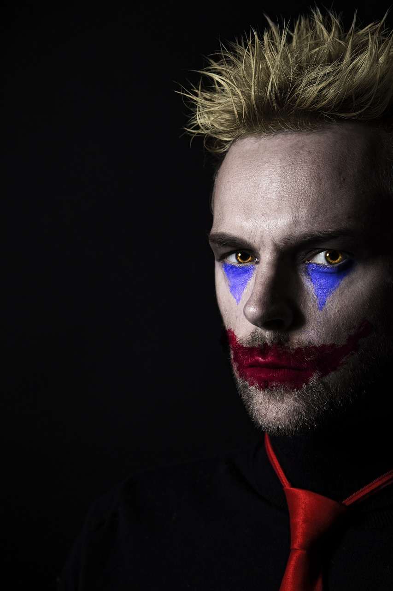

¿Nacemos malos o nos hacemos malos?

Esto me lo he preguntado gran parte de mi vida. La vida es sorprendente, a veces te encuentras personas que parecen mentira de lo “buenas” que son, pero otras veces la vida no es tan color de rosa, hay gente mala, muy mala y luego vienen los muy muy muy malos.

¿Qué pasa con esa gente?, ¿que vivieron para ser así?, ¿que daña tanto tu vida para elegir lastimas a las personas y no sentir la más mínima empatía?

Estamos claros que hay casos clínicos, esas personas que no sienten empatía, que son malas y no sienten remordimiento, pero ¿qué hay de aquellas que si les abres el cerebro no encuentras nada diferente? ¿nacieron malas o se hicieron malas?

En estos días leí un experimento que hicieron algunos científicos, tomaron 10 bebés y les mostraron una mini obra en la que habían dos peluches, uno golpeaba al otro y el otro sólo sufrió, luego les dieron a elegir uno de los dos peluches. Resulta que casa 9 de cada 10 eligió el peluche que sufría (no el malévolo golpeador). Esto lo hicieron con varios grupos obteniendo en promedio el mismo resultado, finalmente concluyeron que las personas nacían buenas, que éramos buenos por naturaleza porque 9 de cada 10 bebés eligieron el “bueno”. 

Pero esperense, 9 de cada 10, ¿cómo no ven que hay 1 bebe en ese experimento que eligió el malo? ¿Qué clase de bebe con solo meses elige el peluche que es golpeador? ¿Qué pasa por el cerebro de ese bebe?yo fuera la madre de ese bebe y estaría devastada. Esperen, eso es una muestra, por lo cual representa el 10% de los bebés ese 1 de cada 10, en una muestra de 1.000 bebés representa 100 bebés, ¿sabemos cuántos bebés hay en el mundo? son el futuro, hay un sin fin de bebés por ahí que simplemente van a elegir el peluche malo. 

Esos bebés crecerán, serán nuestros vecinos, amigos de nuestros hijos, y ¿los científicos concluyen que somos “buenos” por naturaleza? 

Bueno pueden tener un punto, puede ser que al final no sea tan malo elegir el otro peluche, después de todo, no estoy segura cual hubiese elegido yo, capaz no es una decisión tan simple como parece.

Capaz la maldad son caminos y nada más, capaz no somos personas buenas o malas, somos personas que tomamos a veces un camino bueno y otras veces no.  

Si pensamos en retrospectiva, creo que todos hemos sido malos alguna vez en la vida. A veces te sientes más fuerte siendo malo (esto sería otro tema interesante de ver porque), entonces vamos por la vida tomando decisiones y lo que esperamos como personas “normales” es que al final la suma y resta de nuestras decisiones sean más buenas que malas o en el peor de los casos la resta sea 0.

Y ahora vamos un poco más profundo, ¿qué es ser malo? al final es un concepto bastante subjetivo, algo que como sociedad catalogamos así. Una vez un “amigo” me lo pregunto y me puse a analizarlo realmente y fue muy aterrador, pensar que mi concepto de maldad podría estar equivocada, es aterrador, ¿ver el mundo de una manera diferente?, un mundo un poco más “cruel” desde mi perspectiva.

Pero sin duda es una pregunta valida, ¿han visto la película del Guasón? no se si soy muy mala, pero en un punto uno puede hasta llegar a empatizar con él, entender que el mundo es una mie… y que algunas personas no “merecen” que les vaya bien. 

Vivimos en una sociedad injusta, donde la maldad es ser “vivos”, “pilas” “más inteligentes” ahora por otro lado tampoco somos los encargados de “hacer justicia” vivimos en un sistema con leyes y esas cosas. 

Lo que es un hecho es que a veces los seres humanos podemos ser muy crueles, crueles con personas que no deberíamos (en realidad con ninguno jajaj) pero posiblemente todos lo hemos sido alguna vez. Pero nunca es mal momento para reflexionar, para pensarlo 2 veces antes de hacer el famoso bullying, es un tema de sumar, si juntos sumamos más que las personas que restan capaz volteamos el sentido del equilibrio del universo y giramos el planeta unos grados más. 

¿Y ustedes que tan malos son?

Comenten más abajo
