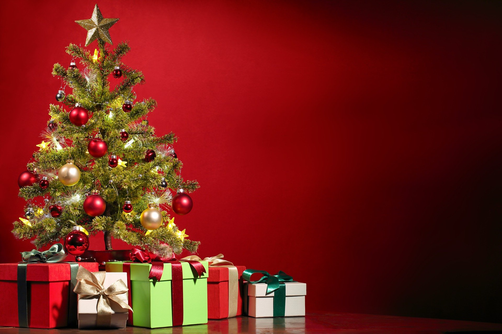

¿No creen que con esto de la navidad los seres humanos somos bastante sádicos?

Les explico, agarramos un cadáver, lo ponemos en nuestra casa, lo decoramos y dejamos que se descomponga poco a poco hasta botarlo, todo esto por una festividad. Esto está permanentemente en nuestra sala, mientras nosotros comemos en abundancia, una cantidad de comida en exceso que nuestro cuerpo no necesita, y gastamos dinero en cosas que tampoco necesitamos para ser feliz con cosas que no nos dan la felicidad. 

Desde mi punto de vista es bastante cruel, aunque no negaré que es bastante contagioso.

Le cantamos canciones a este pobre árbol mientras día tras día se descompone. hasta su muerte sin ningún propósito real, todo esto mientras nosotros los humanos disfrutamos el hermoso olor de la descomposición, que algunos le llaman “olor a navidad”.

Solemos ser  crueles con los seres que conviven con nosotros, en el mismo planeta, algunos días son las vacas, otros los cerdos, otro los pollos y un mes como este es el árbol.

Esperen, y no solo el árbol, que hay del pobre pavo que tiene que morir porque es una “tradición navideña”. Rellenar el pavo todos felices en familia mientras exponen su cadáver en una mesa hermosamente decorada, pavo que en muchos casos ni siquiera se lo comen todo porque es “demasiado”. Su muerte ni siquiera “valió la pena” terminan botando partes de él a la basura como si su vida hubiese valido menos que la de cualquiera de nosotros. 

No es que quiera que todos seamos milagrosamente veganos de la noche a la mañana, cosa que sin duda deberíamos ser, pero entiendo que son costumbres y tradiciones muy arraigadas a nosotros y que hoy en día asociamos tristemente con la “felicidad”, porque esto nos enseñaron desde muy pequeños.

Solo espero que nos cuestionemos nuestras tradiciones, pensemos dos veces antes de repetir estas “tradiciones” que “nos hacen felices”. 

No digo que no celebremos la navidad, esto sería horrible, yo amo la navidad, pero si podemos replantearnos la manera en la que lo hacemos, a quienes estamos afectando en este proceso, tratemos de ser más conscientes, más amables con el resto.

En lo particular se que tambien lo estoy haciendo terrible, todavía hago muchas cosas por “tradición” que sólo afecta y no contribuye a un mundo mejor, pero pensemoslo, trabajemos para que cada navidad sea un poco mas sustentable, mas amigable, más feliz, pero realmente feliz, feliz en el concepto de felicidad para todos. 

Y tú, ¿qué tradición cambiaste para un mundo más feliz?

Comenten más abajo (recarguen la pagina si no salen los comentarios de facebook)

